<div align="center">
  
  <p><strong>Identity Attack Simulation & Security Testing</strong></p>
</div>

# AuthStrike

AuthStrike is an identity and authentication security testing tool for **authorized security assessments, controlled simulations, security research, and education only**.

It helps security teams test Microsoft Entra attack paths such as device-code authentication, token handling, device registration, Microsoft Graph/Outlook access, and supported token-refresh flows.

## How it works

1. Open the operator portal at `/admin`.
2. Sign in and create a new operation.
3. Select the Microsoft client/profile you want to test.
4. AuthStrike generates the campaign URLs for the operation.
5. Send the appropriate URL to an **authorized test participant**.
6. The participant completes the Microsoft device sign-in flow.
7. AuthStrike captures and monitors the resulting authentication state.
8. Use the operator portal to inspect tokens, accounts, refresh results, Outlook/Graph access, and other supported test workflows.

Public campaign URLs stay separate from the protected operator portal.

## Requirements

- Python 3.10+
- pip
- An authorized Microsoft Entra test tenant
- Dedicated test users/devices for the scenarios being tested
- Appropriate Microsoft client/application configuration and permissions
- HTTPS for production deployments

## Configuration

Create the environment file:

```bash
cp .env.example .env
```

Set the required values:

```text
FLASK_SECRET_KEY=...
AUTHSTRIKE_ADMIN_USERNAME=admin
AUTHSTRIKE_ADMIN_PASSWORD_HASH=...
AUTHSTRIKE_HTTPS=true
STORE_RAW_TOKENS=false
FLASK_DEBUG=false
```

Generate a secret:

```bash
python3 -c "import secrets; print(secrets.token_urlsafe(48))"
```

Generate the administrator password hash:

```bash
python3 scripts/create_password_hash.py
```

Keep `.env` private. Raw token persistence is disabled by default.

## Local

Create the virtual environment and install dependencies:

```bash
python3 -m venv .venv
source .venv/bin/activate
pip install -r requirements.txt
python3 app.py
```

Open:

```text
http://127.0.0.1:5000/admin
```

For direct HTTP testing:

```text
AUTHSTRIKE_HTTPS=false
```

### Local walkthrough

#### 1. Sign in

Open `/admin` and sign in with the administrator account.

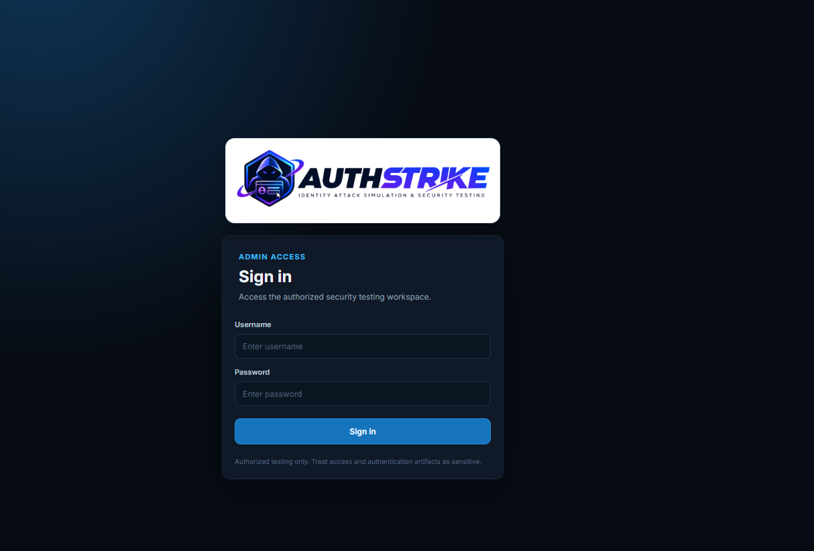

#### 2. Create an operation

Open **New operation**, select the client/profile for the exercise, and create the operation.

The operation page provides the campaign URLs after generation.

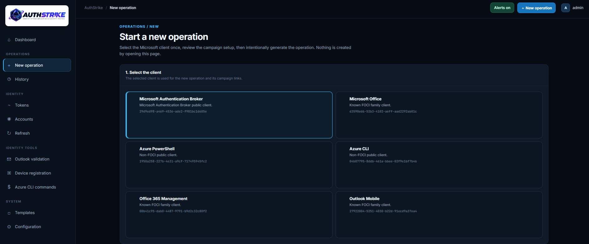

#### 3. Run a campaign

Choose the appropriate campaign URL for the authorized exercise and send it to the authorized test participant.

Current public campaign paths include:

```text
/validation
/outlook-simulation
/adobe-simulation
```

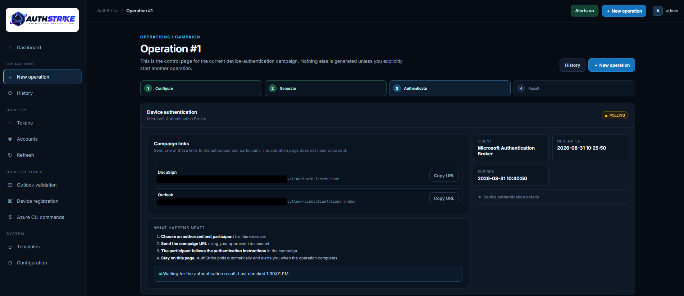

#### 4. Complete device authentication

The participant follows the device-code instructions and completes the Microsoft sign-in.

The operator can keep the operation page open to monitor the authentication result.

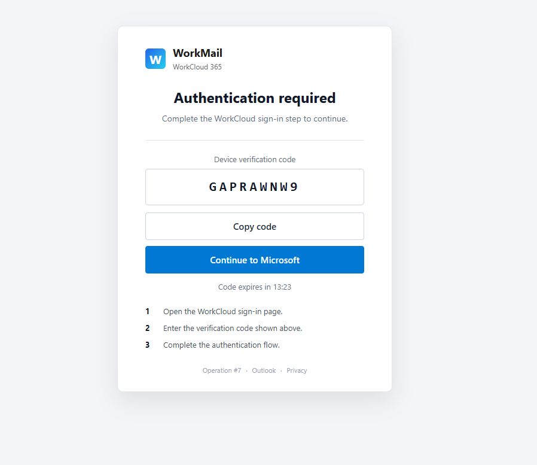

#### 5. Review captured authentication state

After a successful authentication, open **Tokens** to review the active token records.

Use the selector to choose a token. Token details are loaded from the server-side MSAL cache.

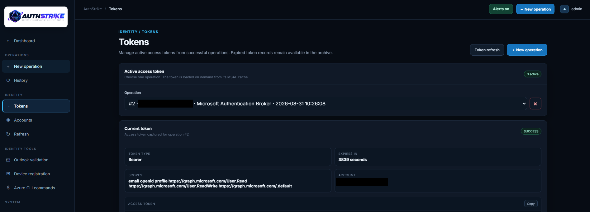

#### 6. Inspect accounts

Open **Accounts** to review accounts recovered from successful operations and inspect the Microsoft Graph `/me` profile.

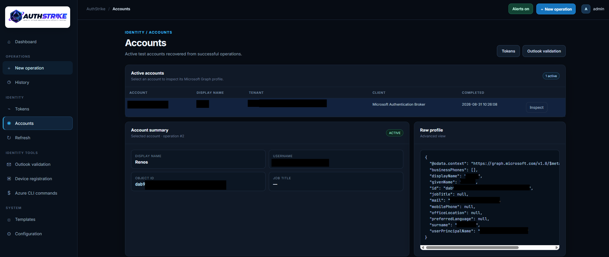

#### 7. Validate Outlook access

Open **Outlook validation**, select a successful operation, and test the available Microsoft Graph / Outlook access.

When the token has the required permissions, the mailbox view can be used to inspect and interact with mail available to the authorized test account.

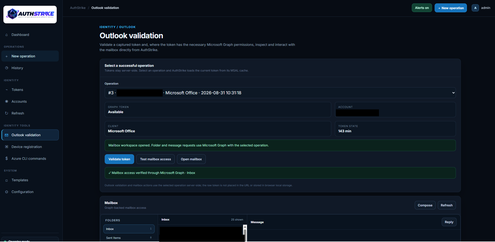

#### 8. Test token refresh

Open **Refresh**, select the operation/client combination you want to test, and request the supported silent acquisition/refresh flow.

Refresh results are stored against the operation and can be reviewed from the token and refresh workflows.

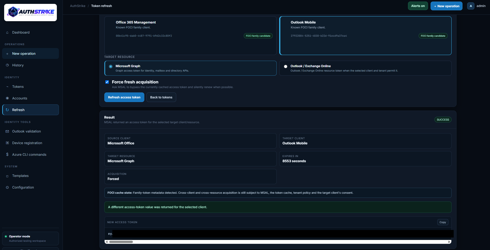

#### 9. Test device registration

Open **Device registration** and select an eligible Microsoft Authentication Broker operation.

The page provides the supported ROADtools commands for the authorized lab workflow.

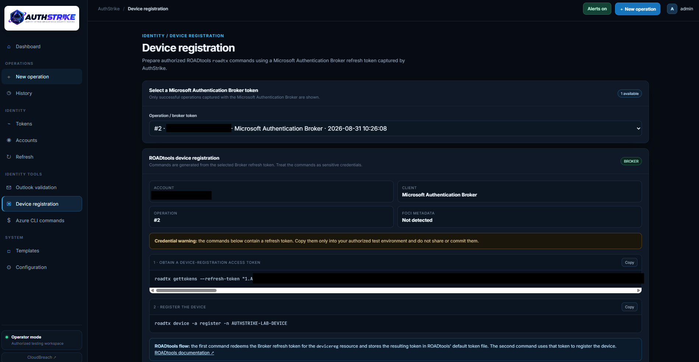

#### 10. Review Azure CLI / PowerShell commands

Open **Azure CLI commands** to select an eligible access token and review the read-only commands for Entra users and groups.

The commands are intended for authorized proof-of-concept testing and should be treated as sensitive because they contain an access token.

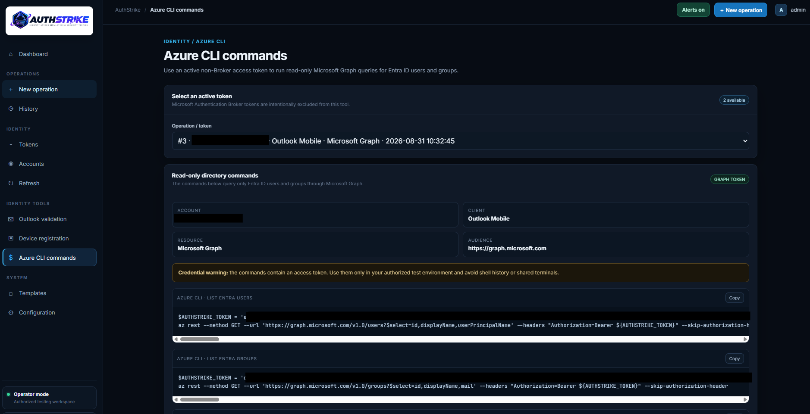

#### 11. Review history

Open **History** to review recent operations, filter/search the list, and open individual operations.

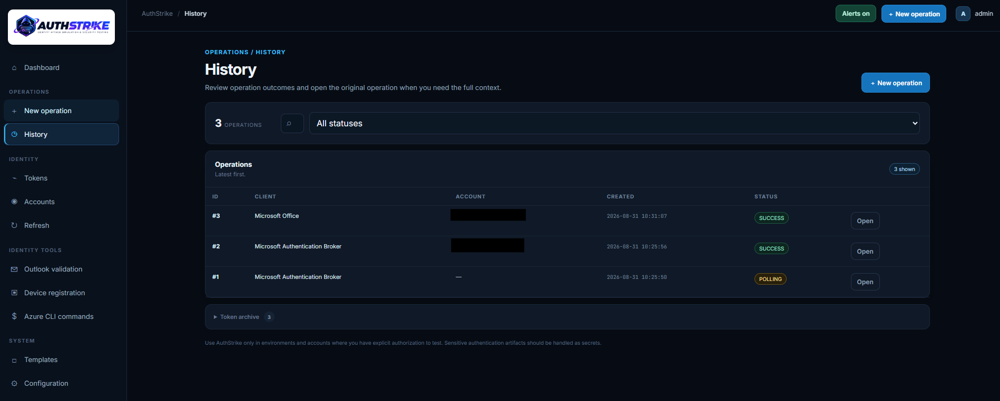

#### 12. Reset test data

Use the workspace reset action when you intentionally want to clear AuthStrike's stored test state.

Do this only when you no longer need the existing operation, token, and cache data.

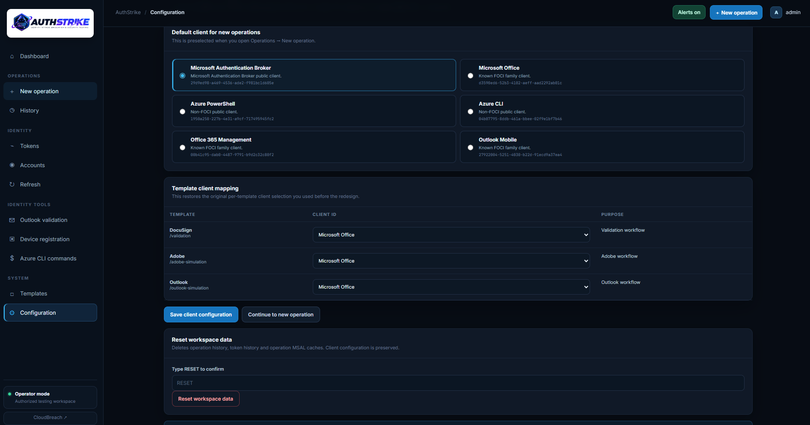

## Docker

Create `.env` from `.env.example`, then:

```bash
cd Docker
docker compose up --build -d
```

Open:

```text
http://127.0.0.1:5000/admin
```

The Docker runtime volume stores shared application state and operation MSAL caches. Do not remove it unless you intentionally want to reset that state.

To stop the deployment:

```bash
docker compose down
```

## Azure App Service

The repository includes a deployment script:

```bash
cd scripts/
chmod +x deploy.sh
./deploy.sh
```

The script asks for the Azure resource group and Web App name, packages the application, deploys it, and restarts the App Service.

Set the App Service configuration values required by `.env.example`, including:

```text
FLASK_SECRET_KEY
AUTHSTRIKE_ADMIN_USERNAME
AUTHSTRIKE_ADMIN_PASSWORD_HASH
AUTHSTRIKE_HTTPS=true
STORE_RAW_TOKENS=false
FLASK_DEBUG=false
```

Use HTTPS in production.

After deployment, open:

```text
https://<your-app-service-hostname>/admin
```

> Keep the App Service runtime configuration and startup command aligned with the included deployment script. The public campaign URLs do not require operator authentication.

### Token refresh and FOCI

AuthStrike uses MSAL's token cache for silent acquisition and supported refresh flows. Cross-client behavior depends on the client, cached authentication state, and Microsoft Entra authorization.

## IOCs & Detection Indicators

The following paths can be used as high-confidence detection indicators for an AuthStrike exercise.

| Indicator | Description | Priority |
| --- | --- | --- |
| `/validation` | Public simulation URL | High |
| `/outlook-simulation` | Public simulation URL | High |
| `/adobe-simulation` | Public simulation URL | High |
| `runtime/caches/operation_*.bin` | Server-side artifact | High |

## Security and data handling

- Treat access tokens, ID tokens, MSAL caches, and mailbox data as sensitive.
- Raw token persistence is disabled by default.
- Use HTTPS for production deployments.
- Use AuthStrike only in environments and accounts where you have explicit authorization.
- Review retention and cleanup settings before using the tool for long-running environments.

## License

GNU General Public License v3.0 (GPLv3)

## Contribution

Contributions are welcome. Open an issue or submit a pull request with improvements, bug fixes, or documentation updates. If you add features that change token handling or storage, document the changes and security implications.
